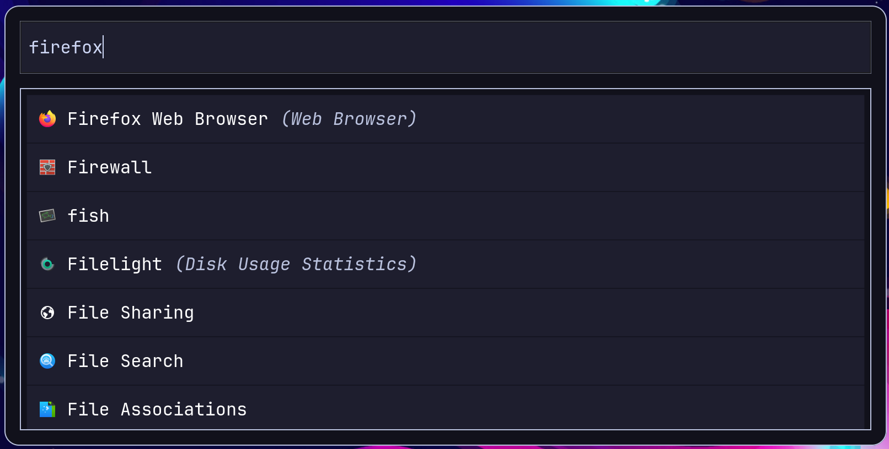

# Spotlight search for linux

For people who want dynamic searching using prefixes



# Installation

## Requirements

Please note that this list is not exhaustive.
You might need more, just pay attention to the output of pip as its installing.

### MacOS

install brew (link me)

```
brew install git python cmake pkgconf cairo gobject-introspection libqalculate npm gtk4
```

You have an additional pip requirement so after following the other installation steps run:
```
pip3 install pyobjc
```
This package provides python bindings to MacOS objectice C libraries.


### Linux
(Non exhaustive, just pay attention to pips output)
```
npm
libqalculate-devel
python
cmake
gobject-introspection
gtk4
```
### Additional requirements for wayland users:
```
gtk4-layer-shell
```

## Final step

Run this while in the project root directory:
```sh
python3 -m venv .venv
source .venv/bin/activate
make install
```


# How to use

Run the program by typing `make run` or just `make`. To set up a keybind, refer to your desktop enviroment.

The default state for the app is app searching, where your query is used to sort through your installed applications. 
To run your app, just either click on it, or press tab until it is selected.
(see reccomendations heading for why you cant just press enter)


The main feature that differentiates Lumin is that its modes are selected via text prefixes.

- `;d` for dictionary module
- `;c` OR `/` for the calculator module
(These prefixes can be edited in the config.)

The config file is located at `~/.config/lumin/config.toml`. You can also theme the app by creating a file at `~/.config/lumin/index.css`.
If you are editing a theme, you probably want the GTK inspector up which can be accessed by running the program with `make run-debug`.


# TODO
## For beta release

- [x] App icons
- [x] Theming based on file name in config
- [x] Configurable css
- [ ] Handle case where .config dir doesnt exist
- [ ] Do the ugly workaround for only pressing enter to run
- [ ] Copy result of math module to clipbard


## For later
- [ ] Support [rofi dmenu](https://github.com/davatorium/rofi/wiki/dmenu_specs)
- [ ] Web searching (i.e !w car -> https://en.wikipedia.org/wiki/car)
- [ ] Probably do an entire re-write of the program in a faster language. 
    I am very limited by pythons performance just from having to load GTK, even ignoring everything else.
